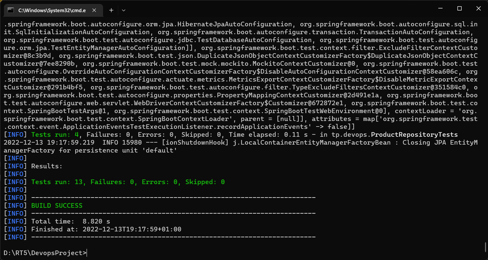

# Devops project
### This project is created to test the process of a CI/CD pipeline using Jenkins.
## below you may find our class diagram used for this project:


to run tests locally:
```java
mvn test
```
This is the output: 


## The main purpose of our pipeline is: 
1. Check for both JDK and maven versions
2. Run unit tests
3. Perform tests and scans using SonarQube
4. Publish .jar file to Nexus


In order to make this possible we used a bridged network to allow communication between Jenkins, SonarQube and Nexus containers


## Results of the SonarQube scan: 


